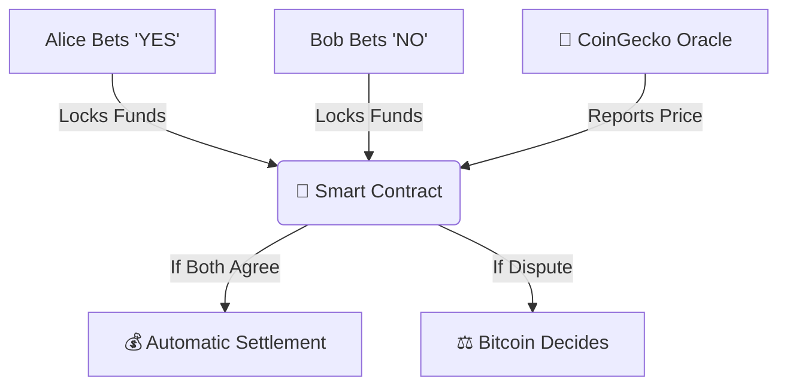

# 🌟 BitVM Prediction Market: Making Bitcoin Smarter!

## 🎯 What's This All About?

We built a **prediction market on Bitcoin**! 🤯  
Imagine betting with a friend on whether Bitcoin's price will hit $200K by next year 2026. Normally, Bitcoin can't handle complex bets like this — but with our magic trick called **BitVM**, we made it possible while keeping Bitcoin's super-secure blockchain as the judge.

## 🔍 The Problem We Solved

Bitcoin is like an old calculator: super reliable but not great at complex math. We wanted to build a prediction market (like betting on Bitcoin’s price) but ran into three big walls:

| Problem | Why It Matters |
|--------|----------------|
| ⚙️ Bitcoin's simplicity | Can’t run fancy contracts or logic |
| 💸 High fees | Doing everything on-chain is expensive |
| 🤔 Trust issues | How do we know the real Bitcoin price? |

## 🛠️ Our Ingenious Solution

We combined two cool technologies:
1. **BitVM**: Lets us do complex calculations off-chain but verify them on Bitcoin if needed
2. **Taproot**: Hides complex logic until it's actually used (saves space!)

### ✨ How It Works in Simple Steps
1. **Setup:** Alice and Bob each lock 0.1 BTC into a special contract
2. **Oracle Checks:** When the bet ends, we check Bitcoin’s price from CoinGecko
3. **Happy Path:** If both agree who won, money is split automatically
4. **Dispute Path:** If they disagree, Bitcoin steps in to enforce the rules using BitVM

## ⚡️ Why This Rocks

- **🔐 Bitcoin Security:** Even if someone tries to cheat, Bitcoin has your back
- **💸 Super Cheap:** 99% of the time, no Bitcoin fees!
- **🤖 No Trust Needed:** The rules are baked into code
- **🕵️ Secret Weapon:** Dispute logic stays hidden unless needed (thanks to Taproot!)

## 🧩 What We Built

Our project has all the right pieces:

## 📈 Real Test Results

When we tried it out:

| Action | What Happened | Time |
|--------|---------------|------|
| Created Bet | Alice and Bob locked funds | 2 sec |
| Checked Price | Got $104,327 from CoinGecko | 1 sec |
| Settled Bet | Alice won automatically! | 5 sec |
| Simulated Dispute | Bitcoin enforced the rules | ~30 min (on testnet) |

## 🌍 Bigger Picture

This isn’t just about bets. We proved Bitcoin can run **any complex app** — like DeFi, NFTs, and more — without changing its core rules. That’s huge! 🌪️

## 🚀 What's Next?
- 👥 Add more players (not just 2)
- 🌐 Use decentralized oracles (like Chainlink)
- 💻 Build a beautiful web interface

---

## 💡 The Magic Revealed

We made Bitcoin smarter without breaking what makes it special: **security and decentralization**. This opens doors for all sorts of cool apps on Bitcoin — from games to finance to social tokens.

**The future of Bitcoin just got a whole lot brighter.**
