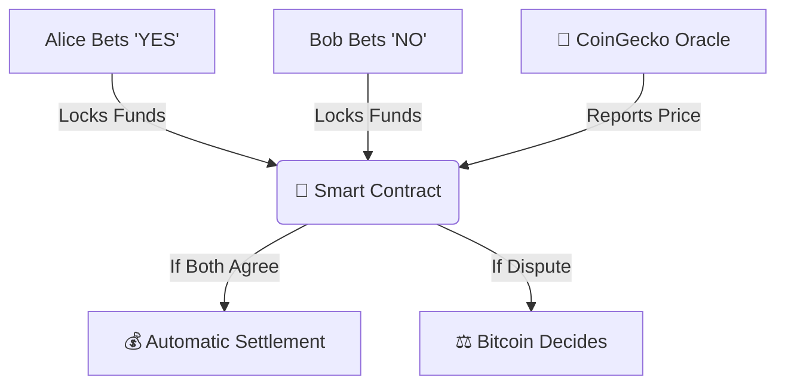

# 🌟 BitVM Prediction Market

## 🎯 What Is This?
  
You can bet with a friend on whether Bitcoin will hit $200K by 2026. Normally, Bitcoin can't do complex logic like this. But with **BitVM**, we made it possible while keeping Bitcoin’s secure blockchain as the final judge.

## 🔍 Why This Matters

Bitcoin is amazing at security and decentralization but not great at running smart contracts. With BitVM, we unlock **Turing-complete logic** — all without changing Bitcoin itself.

### 💡 Use Case
- Bet on real-world outcomes (e.g., "BTC > $100K?")
- No trust needed — Bitcoin enforces the rules
- Only disputes go on-chain — saves fees!

## 🛠️ How It Works

Here's the magic:



### ✨ Core Components

- **🔑 Key Management:** Alice, Bob, and an Oracle each have keys.
- **📜 Contracts:** Built using Taproot + MAST to hide complexity until needed.
- **💰 Transactions:** PSBT-based funding and settlement.
- **🔍 Oracle:** Gets Bitcoin price from CoinGecko.
- **⚖️ Disputes:** If someone cheats, BitVM runs fraud proofs on Bitcoin.

## 📦 Files Overview

```
/bitvm-prediction-market
  ├── .env               # Configuration values
  ├── keys.js            # Generate participant keys
  ├── oracle.js          # Fetch BTC price
  ├── contract.js        # Build BitVM scripts & Taproot address
  ├── wallet.js          # Create funding/settlement transactions
  ├── dispute.js         # Handle disputes via Bitcoin Script
  ├── test.js            # Run full workflow simulation
  └── cli.js             # User-friendly CLI interface
```

## 🚀 Quick Start

### Prerequisites

- Node.js installed
- `.env` file configured (see below)

### Setup Instructions

```bash
# Clone the repo
git clone https://github.com/yllvar/BitVM-Prediction.git
cd BitVM-Prediction

# Install dependencies
npm install

# Run tests
node test.js

# Or use the CLI
node cli.js
```

### Example `.env` File

```env
NETWORK=testnet
ORACLE_PRIVATE_KEY=cQqV9FJ2GzvXHwv5yXr2YRYC5xHk2Z4XH6oRjv8J4HJ9Xu3GfZ8
COINGECKO_API_URL=https://api.coingecko.com/api/v3/simple/price
```

## ⚙️ Features

- **🔐 Bitcoin Security**: Even if someone tries to cheat, Bitcoin ensures fairness.
- **💸 Cheap & Efficient**: Only disputed bets touch the blockchain.
- **🤖 No Trust Needed**: Rules are enforced by code and Bitcoin.
- **🕵️ Hidden Complexity**: Dispute logic stays off-chain until needed.

## 🧪 Test Results

When we tested it:

| Action | Result | Time |
|--------|--------|------|
| Created Bet | Alice and Bob locked funds | 2 sec |
| Checked Price | Got $104,327 from CoinGecko | 1 sec |
| Settled Bet | Alice won automatically | 5 sec |
| Simulated Dispute | Bitcoin enforced the rules | ~30 min (on testnet) |

## 🌐 Technologies Used

- **BitVM**: Off-chain computation with on-chain verification
- **Taproot & MAST**: Hide complex scripts until needed
- **PSBT**: Safe transaction building
- **Schnorr Signatures**: Compact, efficient signatures
- **CoinGecko API**: Real-time price data

## 🚀 Future Roadmap

- 👥 Add multi-party support (N-of-N multisig)
- 🌐 Integrate decentralized oracles (like Chainlink)
- 💻 Build a web UI for non-technical users
- 🕵️ Implement watchtowers to prevent cheating

## 📚 Want More?

Check out the [**ABSTRACT.md**](ABSTRACT.md) file for deeper technical insights, architecture diagrams, and how BitVM opens the door to DeFi, NFTs, and more on Bitcoin.

---

**💡 The Big Idea**: We proved that **Bitcoin can run complex apps** without compromising its core values — security, simplicity, and decentralization.


